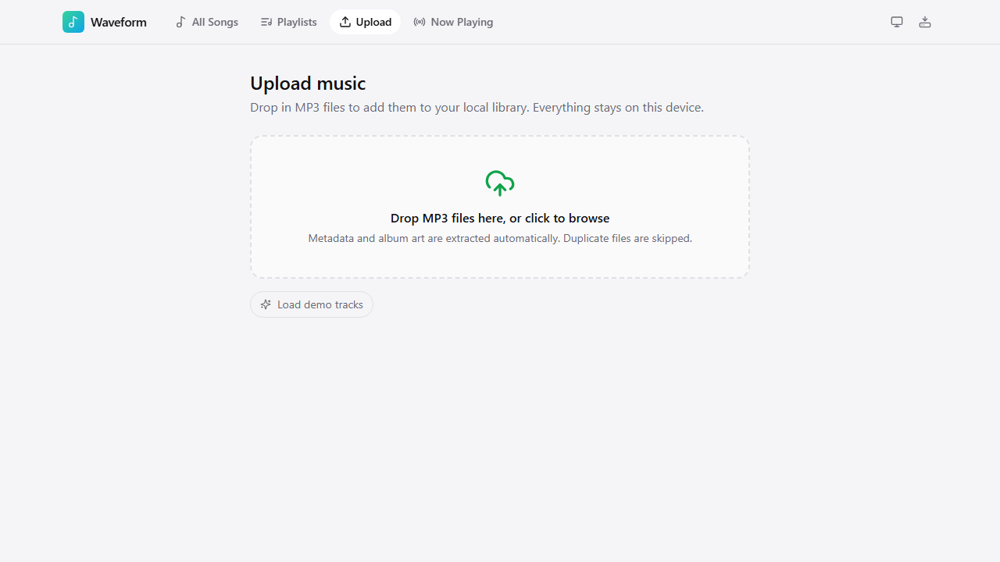
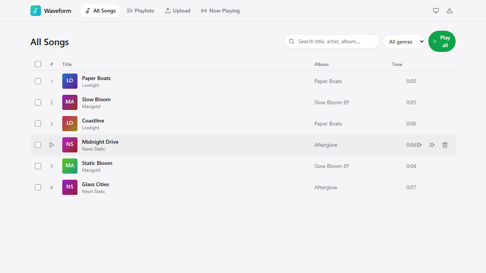
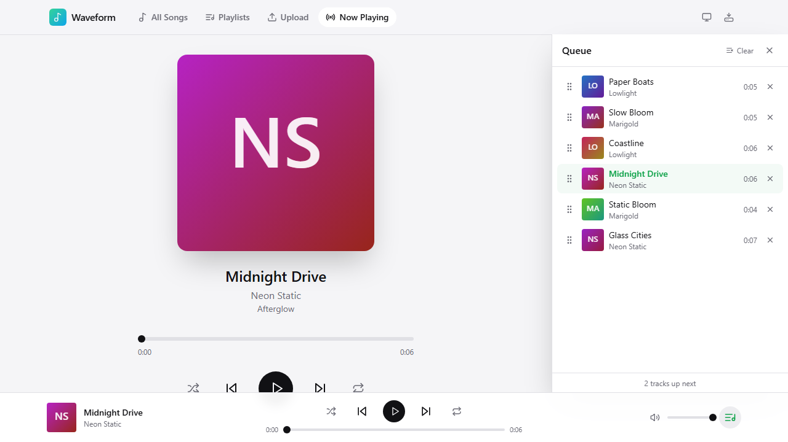

# Waveform — Local Music Player

A Spotify-style, installable PWA for listening to your own MP3s. Upload
files, get ID3 metadata and album art extracted automatically, and
everything — audio, artwork, playlists — is stored locally in IndexedDB.
There is no backend and no account: your library never leaves the browser.





## Features

- **Upload** — drag-and-drop or file picker, batch import, per-file
  progress, dedupe by SHA-256 content hash so re-imports are skipped.
- **All Songs** — search across title/artist/album, filter by genre, sort
  by any column, multi-select to bulk queue / play-next / add to playlist.
- **Playlists** — create, rename, delete; drag-and-drop reordering inside
  a playlist; add songs from a searchable picker.
- **Now Playing** — large artwork, scrubbable timeline, shuffle/repeat,
  "Up next" preview, and a collapsible, drag-reorderable queue drawer
  available from any page via the player bar.
- **Offline-first** — audio and artwork are read from IndexedDB, so
  playback and browsing work with no network connection after first load.
- **Installable PWA** — manifest + service worker (Workbox via
  `vite-plugin-pwa`), works as a standalone app on desktop and mobile.
- **Media Session integration** — lock-screen / hardware media key
  controls (play, pause, next, previous, seek) on supported platforms.
- **Backup & restore** — export your library as JSON (metadata-only, or
  with embedded audio) and re-import it, deduped by content hash.
- **Light/dark theme**, keyboard-accessible controls, reduced-motion
  support.

## Tech stack

- [Vite](https://vitejs.dev) + React 18 + TypeScript (strict mode)
- [Tailwind CSS](https://tailwindcss.com) with CSS-variable theming
- [Dexie](https://dexie.org) for IndexedDB (tracks, blobs, playlists, settings)
- [music-metadata-browser](https://github.com/Borewit/music-metadata-browser) for ID3 tag + artwork extraction (lazy-loaded)
- [@dnd-kit](https://dndkit.com) for accessible drag-and-drop reordering
- [vite-plugin-pwa](https://vite-pwa-org.netlify.app) (Workbox) for the service worker
- [lucide-react](https://lucide.dev) for icons
- [react-router-dom](https://reactrouter.com) for client-side routing

## Getting started

```bash
npm install
npm run dev       # http://localhost:5173
```

Other scripts:

```bash
npm run build      # type-check + production build to dist/
npm run preview    # serve the production build locally
npm run lint        # ESLint
npm run format       # Prettier (writes)
```

### Demo data

For quick UI testing without hunting for real MP3s, the Upload page shows
a **"Load demo tracks"** button whenever `npm run dev` is used (or when
`VITE_ENABLE_DEMO_SEED=true` is set for a production build). It inserts a
handful of tiny synthetic tracks (a few seconds of a sine tone each) with
mock metadata and one demo playlist, entirely client-side — no fixture
files needed. It's idempotent; running it twice won't duplicate tracks.

## Data model

```
┌────────────┐        ┌───────────┐
│  tracks    │        │  blobs    │
├────────────┤        ├───────────┤
│ id (PK)    │──┐     │ id (PK)   │
│ title      │  │     │ type      │  'audio' | 'artwork'
│ artist     │  ├────▶│ blob      │
│ album      │  │     │ mimeType  │
│ duration   │  │     └───────────┘
│ year?      │  │       ▲
│ genre?     │  │       │ artworkBlobId (optional FK)
│ trackNo?   │  │       │
│ artworkBlobId? ───────┘
│ audioBlobId ───────────┘ (required FK)
│ contentHash│  (SHA-256 of audio bytes, dedupe key)
│ fileName, fileSize, mimeType
│ createdAt, updatedAt
└────────────┘

┌──────────────┐        ┌───────────────────┐
│  playlists   │        │  app (singleton)  │
├──────────────┤        ├───────────────────┤
│ id (PK)      │        │ id: 'settings'    │
│ name         │        │ theme             │
│ trackIds[]   │──────▶ tracks.id (ordered) │ repeat, shuffle, volume
│ createdAt    │        │ lastQueue[]        │ (ordered playback queue)
│ updatedAt    │        │ lastQueueIndex     │
└──────────────┘        │ lastPositionSec    │
                         │ queueDrawerOpen    │
                         └───────────────────┘
```

All four stores live in a single Dexie database (`waveform-music-db`,
schema version 1, see [src/db/indexedDb.ts](src/db/indexedDb.ts)). Bump
the Dexie `version()` and add an `.upgrade()` block there if you change
the schema later — Dexie handles the migration on next open.

The **playback queue** itself is not a separate store: it's an in-memory
array of track ids (`queue`) plus a `currentIndex`, managed by
[`usePlayer`](src/hooks/usePlayer.tsx) and mirrored into `app.lastQueue` /
`app.lastQueueIndex` / `app.lastPositionSec` so the session survives a
reload.

## PWA: install & offline testing

**Install**

1. `npm run build && npm run preview` (or deploy to Vercel — service
   workers need a real HTTP(S) origin; `file://` won't work).
2. Open the site in Chrome/Edge — you'll see an install icon in the
   address bar (or "Install app" in the browser menu). On mobile Chrome,
   use "Add to Home screen". On iOS Safari, use Share → "Add to Home
   Screen" (see [known limitations](#known-limitations) below).
3. Launch the installed app — it opens in its own standalone window.

**Offline test**

1. With the app open and at least one song imported, open DevTools →
   Application → Service Workers and confirm one is `activated`.
2. DevTools → Network → set to "Offline" (or actually disconnect).
3. Reload the page. The app shell, your song list, artwork, and playback
   of already-imported tracks should all keep working, because:
   - the app shell/JS/CSS are precached by the service worker,
   - your tracks/artwork/playlists live in IndexedDB (not the network),
   - audio/artwork blobs are read from IndexedDB and turned into local
     `blob:` object URLs, so they never hit the network either.
4. Navigating to a route that was never cached while fully offline (e.g.
   a fresh install with no prior visit) falls back to
   `public/offline.html` with a friendly message instead of the browser's
   default error page.

## Backup & restore

Use the download icon in the top bar ("Backup and restore"):

- **Export metadata (.json)** — tracks + playlists only. Small file,
  good for syncing your playlist structure across devices, but audio
  won't be attached on import (tracks are re-linked automatically if you
  re-upload the same MP3s, since dedupe matches on content hash).
- **Export with audio (.json)** — same, plus every audio/artwork blob
  embedded as base64. This can be a large file (roughly 1.3× your total
  library size, since base64 inflates binary data) but is fully
  self-contained and playable after import with no re-uploading.
- **Import backup file…** — pick a previously exported `.json` file.
  Tracks are matched by content hash; anything already in your library is
  skipped (reported as "skipped duplicates"), so importing the same
  backup twice is safe.

There's no ZIP packaging — a single JSON file (optionally with embedded
base64 audio) was chosen to avoid pulling in a zip library for what's
fundamentally a small, occasional export.

## Accessibility

- All interactive controls have `aria-label`s; toggle buttons expose
  `aria-pressed`/`aria-expanded`; the queue drawer is `aria-controls`'d
  from its trigger.
- Focus rings (`focus-visible`) throughout; a "Skip to main content" link
  is the first focusable element.
- The queue drawer and dialogs (confirm delete, rename) are dismissible
  with <kbd>Escape</kbd> and manage focus on open.
- Toasts are announced via `aria-live="polite"` without stealing focus.
- `prefers-reduced-motion` is respected globally (see
  [src/styles/tailwind.css](src/styles/tailwind.css)).

## Known limitations

- **Storage quotas.** IndexedDB storage is subject to the browser's
  quota (often a percentage of free disk space, but much more
  conservative in private/incognito mode). Large libraries (many hours of
  MP3s) can hit this; imports that fail with a quota error surface a
  clear message instead of silently corrupting data. Check current usage
  in DevTools → Application → Storage.
- **Safari / iOS.** Service worker support and storage persistence are
  more restrictive than Chromium/Firefox — Safari can evict IndexedDB
  data for sites the user hasn't interacted with in a while, and
  "Add to Home Screen" (rather than an install prompt) is the only
  install path. Background/lock-screen media controls via Media Session
  work in Safari but action coverage (e.g. seek) is more limited than
  Chromium.
- **Placeholder icons.** `public/icons/*.svg` are vector placeholders
  (a gradient app icon + a maskable variant). They work fine as manifest
  icons in Chromium browsers; for broadest compatibility (older Android
  WebViews, `apple-touch-icon` on iOS wants a raster image) swap in real
  PNG exports at 192×192 and 512×512 before shipping to end users.
- **No server-side transcoding.** Only browser-decodable formats play
  (MP3 via the native `<audio>` element); the uploader filters to `.mp3`
  and `audio/mpeg`.
- **Shuffle** picks a uniformly random next track each time rather than
  precomputing a shuffled play-through order, so it's possible (if
  unlikely) to hear the same track close together in a long session.

## Deploying to Vercel

1. Push this repo to GitHub/GitLab/Bitbucket.
2. In Vercel: **Add New → Project → Import** your repo.
3. Framework preset: **Vite** (auto-detected). Build command
   `npm run build`, output directory `dist` (both auto-detected from
   `package.json`/`vercel.json`).
4. Deploy. `vercel.json` in this repo already rewrites all non-asset
   routes to `/index.html` so client-side routing (`/songs`,
   `/playlists/:id`, etc.) works on refresh/deep-link.
5. No environment variables or backend services are required — the app
   is fully static and client-side.

## Acceptance tests

Manual smoke test to run after any significant change (also useful right
after first `npm run dev`):

1. **Upload** — go to *Upload*, drag in one or more `.mp3` files (or
   click "Load demo tracks" for instant test data). Confirm each file
   shows a progress row that ends in a green check, and a toast reports
   how many songs were imported.
2. **Songs appear** — go to *All Songs*; the imported tracks are listed
   with correct title/artist/album/duration.
3. **Artwork shows** — tracks with embedded cover art show it; tracks
   without show a colored gradient with initials (deterministic per
   artist/title).
4. **Add to queue** — hover a row, click the queue-plus icon; a toast
   confirms; the queue count updates.
5. **Play** — click a row (or "Play all"); the bottom player bar appears,
   shows the track, and the transport controls work (play/pause, seek,
   next/prev, shuffle, repeat).
6. **Collapse/expand queue** — click the queue icon in the player bar;
   the queue drawer slides in showing "up next" tracks with drag handles;
   toggling again (or its own close button, or <kbd>Escape</kbd>) hides
   it. On desktop, the page content shifts to make room rather than being
   covered.
7. **Create playlist** — go to *Playlists* → "New playlist", name it,
   confirm it appears in the grid.
8. **Add songs** — open the playlist, "Add songs", pick a few tracks from
   the picker, confirm the count updates.
9. **Reorder** — drag a track by its grip handle to a new position in the
   playlist; the order persists on reload.
10. **Offline reload** — go offline (see [PWA testing](#pwa-install--offline-testing)
    above) and reload; your library, playlists, and playback of
    already-imported tracks still work.

## Project structure

```
music-player/
├── index.html
├── vite.config.ts            # VitePWA (Workbox) + @ alias config
├── vercel.json                # SPA rewrites for client-side routing
├── tailwind.config.ts
├── postcss.config.js
├── tsconfig.json
├── .eslintrc.cjs
├── .prettierrc
├── public/
│   ├── manifest.webmanifest
│   ├── offline.html           # navigateFallback for the service worker
│   └── icons/
│       ├── icon.svg
│       └── icon-maskable.svg
└── src/
    ├── main.tsx                # root render + SW registration
    ├── App.tsx                 # routes + persistent chrome (TopBar/PlayerBar/QueueDrawer)
    ├── types.ts                 # Track, Playlist, BlobDoc, AppSettings, etc.
    ├── vite-env.d.ts
    ├── db/
    │   └── indexedDb.ts          # Dexie schema, settings helpers, cascade delete
    ├── lib/
    │   ├── id3.ts                 # ID3 parsing (lazy-loaded) + filename fallback
    │   ├── audio.ts                # duration formatting, object-URL cache, placeholder art
    │   ├── hash.ts                  # SHA-256 content hashing for dedupe
    │   ├── backup.ts                 # export/import JSON backups
    │   └── seed.ts                    # dev-only demo library seeding
    ├── hooks/
    │   ├── usePlayer.tsx               # queue/transport/session state + Media Session
    │   ├── useIndexedDb.ts              # Dexie live-query hooks
    │   ├── useToast.tsx                  # toast context
    │   └── useTheme.ts                    # light/dark/system theme
    ├── components/
    │   ├── PlayerBar.tsx, QueueDrawer.tsx, SongList.tsx, Artwork.tsx,
    │   │   UploadDropzone.tsx, TopBar.tsx, SearchBar.tsx, PlaylistCard.tsx,
    │   │   AddToPlaylistMenu.tsx, BackupMenu.tsx, ConfirmDialog.tsx,
    │   │   ThemeToggle.tsx, Toasts.tsx
    └── pages/
        ├── Upload.tsx, Songs.tsx, Playlists.tsx, PlaylistDetail.tsx, NowPlaying.tsx
```

## Troubleshooting

- **"Storage quota exceeded" on import** — free up space or clear other
  site data; large libraries need proportionally large browser storage
  quota.
- **Service worker seems stuck on an old version** — `registerType:
  'autoUpdate'` should refresh automatically; if not, DevTools →
  Application → Service Workers → "Unregister", then hard-reload.
- **Metadata looks wrong for a file** — some MP3s have malformed or
  missing ID3 tags; the importer falls back to parsing the filename as
  `Artist - Title` and labels the album "Unknown Album" in that case.
